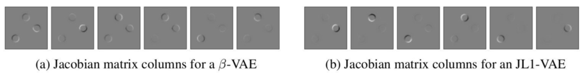
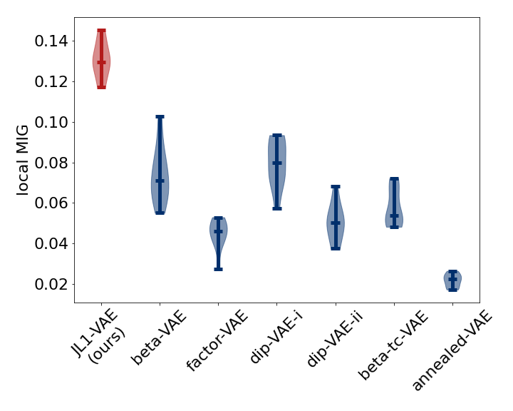

# Local Disentanglement in Variational Auto-Encoders Using Jacobian L<sub>1</sub> Regularization 

This repository is the official implementation of Local Disentanglement in Variational Auto-Encoders Using Jacobian L<sub>1</sub> Regularization




## Requirements

To install requirements for a CUDA-enabled workstation (strongly recommended):
```setup
conda env create -f environment.yml
conda bash init
```

To install requirements without GPU support:
```setup
conda env create -f environment_nogpu.yml
conda bash init
```

## Training

### Small example
An example script how to train a single JL1-VAE model using a small cache of three-dots
data (20,000 images) for only 30,000 training batches of 64 images can be run using
```train
./exampleScripts/train_jlonevae_threeDots.bash
```

### Full experiments
#### Three-dots Data
To train the full three-dots models in the paper, run:
```train
./experimentScripts/train_jlonevae/train_threeDots.bash
```
The first time that is run it will take a few minutes to create a cache of
500,000 training images in the `data/` folder, and will train for 300,000 batches of 64 images. 
Subsequent runs will re-use the same cache of images.

Training logs are written to the `./logs` directory and the trained model is
written to a subdirectory of `./trainedModels` (both as a PyTorch JIT module for use with
[`disentanglement_lib`](https://github.com/google-research/disentanglement_lib) and also using `torch.save(model.state_dict(), ...)`).

Baseline models, for comparison, are trained by calling
```
./experimentScripts/train_baseline/train_standard_tf_models.bash
```
Those models and logs are stored to a subdirectory of the `trainedStandardModels` folder and the model
numbers identify which configuration was used from
[disentanglement_lib](https://github.com/google-research/disentanglement_lib#reproducing-prior-experiments),
now trained on the three-dots dataset.

#### MPI3D-Multi
To train the mpi3d-multi models in the paper,
download [`mpi3d_real`](https://github.com/rr-learning/disentanglement_dataset) (12 gigabytes, so takes a while to download) by running
```download
cd data
./download_mpi3d_real.sh
cd ..
```
and then run
```train
./experimentScripts/train_jlonevae/train_mpi3d_multi.bash
```

Training logs are written to the `./logs` directory and the trained model is
written to a subdirectory of `./trainedModels` (both as a PyTorch JIT module for use with
[`disentanglement_lib`](https://github.com/google-research/disentanglement_lib) and also using `torch.save(model.state_dict(), ...)`).

#### Natural Images
To train the natural image models in the paper, first download the data from
[Bruno Olshausen's website](http://www.rctn.org/bruno/sparsenet/) by running
```download
cd data
conda activate jlonevae
./download_natural_image_data.sh
./sampleNatualImagePatches.py
cd ..
```

Then, run
```train
./experimentScripts/train_jlonevae/train_naturalImages.bash
```

## Evaluation

### Qualtiative 
To evaluate the models qualitatively, from the base directory start a jupyter
notebook by running
```jupyter
conda activate jlonevae
jupyter notebook
```
Then, within the folder `experimentScripts/visualizations`, open any of the
following Jupyter notebooks to view the associated Jacobian columns:
```
ExampleJacobianValues_ThreeDots.ipynb
ExampleJacobianValues-Mpi3d-multi.ipynb
```

For natural image data, you can create Jacobian embeddings for a sequence of
nearby image crops by running
```
./experimentScripts/visualizations/createLatentJacobianImages_naturalImages.bash
```

### Quantitative
To evaluate the three-dots models quantitatively, run
```eval
./experimentScripts/evaluate_jlonevae/evaluate_threeDots.bash
```
You can safely ignore the error `ERROR:root:Path not found: local_mig_base.gin`.

To evaluate the baseline models quantitatively, run
```eval
./experimentScripts/evaluate_baseline/postprocess_baseline_threeDots.bash
./experimentScripts/evaluate_baseline/evaluate_baseline.bash
```
You can safely ignore the error `ERROR:root:Path not found: local_mig_base.gin`.

To visualize the quantitative evaluations, from the base directory run
```jupyter
conda activate jlonevae
jupyter notebook
```
Then, within the folder `experimentScripts/visualizations`, open any of the
following Jupyter notebooks to generate comparison plots:
```
LocalDisentanglementComparedToBaseline.ipynb  
ScatterplotMIGandModularity_VaryingRho.ipynb
```

## Pre-trained Models

Pretrained JL1-VAE and &beta;-VAE models for natural images, three-dots, and
MPI3D-Multi are available [here (external link)](https://drive.google.com/drive/folders/1ac_YjhqWvakTUyHev76iuZcVfuCV76CM?usp=sharing)
Baseline models (&beta;-VAE, FactorVAE, DIP-VAE-I, DIP-VAE-II, &beta;-TCVAE,
and AnnealedVAE) trained on three-dots are available [here (external
link)](https://drive.google.com/drive/folders/1jZJdvp1FhIMmc2s1WTVi9SYi56f5fl_1?usp=sharing)

## Results

Our model achieves qualitatively (see image of Jacobian columns above) and quantitatively (see plot 
of local disentanglement scores below) better local disentanglement compared to baseline methods. More details
can be found in our paper.



## Contributing

This repository is licensed under the Apache License, Version 2.0. To
contribute, please create a pull request.
