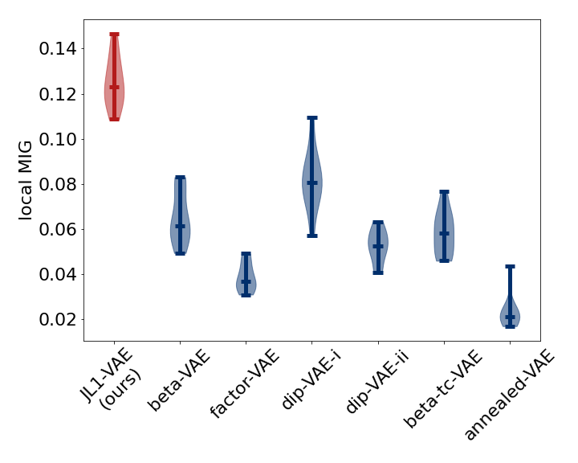

# Local Disentanglement in Variational Auto-Encoders Using Jacobian L<sub>1</sub> Regularization 

This repository is the official implementation of Local Disentanglement in Variational Auto-Encoders Using Jacobian L<sub>1</sub> Regularization


## Requirements

To install requirements for a CUDA-enabled workstation (strongly recommended):
```setup
conda env create -f environment.yml
conda bash init
```

To install requirements without GPU support:
```setup
conda env create -f environment_nogpu.yml
conda bash init
```

## Training

An example script how to train a single JL1-VAE model using a small cache of three-dots
data (20,000 images) for only 30,000 training batches of 64 images can be run using
```train
./exampleScripts/train_jlonevae_threeDots.bash
```

To train the full three-dots models in the paper, run:
```train
./experimentScripts/train_jlonevae/train_threeDots.bash
```
The first time that is run it will take a few minutes to create a cache of
500,000 training images in the `data/` folder, and will train for 300,000 batches of 64 images. 
After that it will re-use the same cache of images.

To train the mpi3d-multi models in the paper,
download [`mpi3d_real`](https://github.com/rr-learning/disentanglement_dataset) (12 gigabytes, so takes a while to download) by running
```download
cd data
./download_mpi3d_real.sh
cd ..
```
and then run
```train
./experimentScripts/train_jlonevae/train_mpi3d_multi.bash
```

Training logs are written to the `./logs` directory and the trained model is
written to `./trainedModels` (both as a PyTorch JIT module for use with
[`disentanglement_lib`](https://github.com/google-research/disentanglement_lib) and also using `torch.save(model.state_dict(), ...)`).

To train the naturalImage models in the paper, first download the data from
[Bruno Olshausen's website](http://www.rctn.org/bruno/sparsenet/) by running
```train
cd data
conda actviate jlonevae
./download_natural_image_data.sh
./sampleNatualImagePatches.py
cd ..

```

## Evaluation
To evaluate the models qualitatively, from the base directory start a jupyter
notebook by running
```jupyter
conda activate jlonevae
jupyter notebook
```
Then, open the notebook at 
`experimentScripts/visualizations/ExampleJacobianValues_ThreeDots.ipynb'
or
`experimentScripts/visualizations/ExampleJacobianValues-Mpi3d-multi.ipynb`
to view jacobian column values for trained models.

To evaluate the three-dots models quantitatively, run
```eval
./experimentScripts/evaluate_jlonevae/evaluate_threeDots.bash
```

## Pre-trained Models

You can download pretrained models here:

- [My awesome model](https://drive.google.com/mymodel.pth) trained on ImageNet using parameters x,y,z. 

>📋  Give a link to where/how the pretrained models can be downloaded and how they were trained (if applicable).  Alternatively you can have an additional column in your results table with a link to the models.

## Results

Our model achieves qualitatively (see image of Jacobian columns above) and quantitatively (see plot 
of local disentanglement scores below) better local disentanglement compared to baseline methods. More details
can be found in our paper.



## Contributing

This repository is licensed under the Apache License, Version 2.0. To
contribute, please create a pull request.

